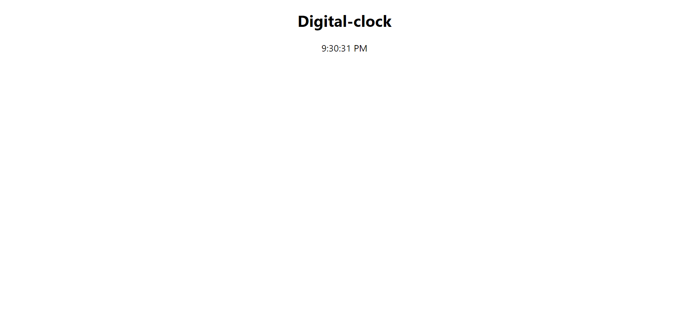

# Digital clock 

# Tech Stack Used 💻

- ReactJS
- React-hooks
- css3
  

## How to run the project 🚀

Please fork the repository and then use it on your own.

You can also take a glimpse of our Project, just follow the below steps:

1. Run the command npm run start in terminal to start the app at port 3000.

2. Go to the browser you will land on the home page.

## Snapshots 📷

1. Home Page

## Features ✨
- Digital clock.

## Demo 🎥

Deployed Link: [Digital clock](https://my-digital-clockk.netlify.app/)

## Team Members and Contributors 😇

👤 Solo Project
- Duration 1 hour
- Github : [Sumitra Awadhiya](https://github.com/sumitra05)
